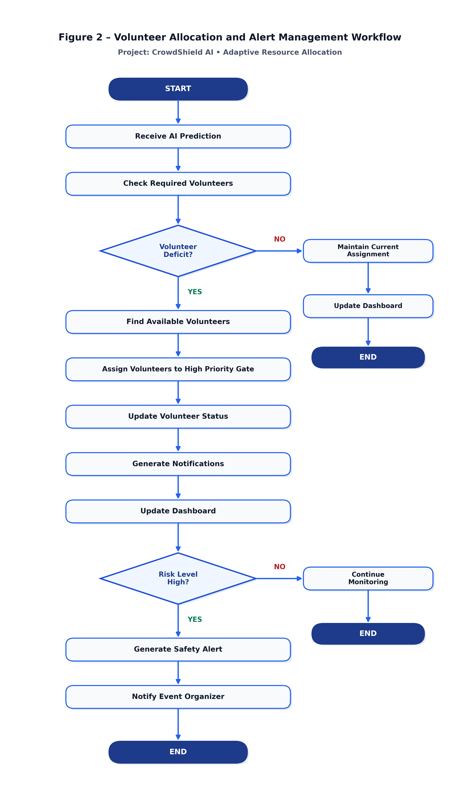

# Figure 2 – Volunteer Allocation and Alert Management Workflow

**Project Name:** CrowdShield AI  
**Document Component:** Adaptive Resource Allocation & Alert Workflow  
**Target Medium:** University Project Report / Technical Documentation  

---

## 📸 High-Resolution System Flowchart

*Figure 2 – Volunteer Allocation and Alert Management Workflow*

---

## 📁 Exported File Paths for Word Report

- **PNG Image (300 DPI High-Res):**
  - [`assets/crowdshield_ai_volunteer_workflow.png`](../assets/crowdshield_ai_volunteer_workflow.png)
  - [`docs/crowdshield_ai_volunteer_workflow.png`](crowdshield_ai_volunteer_workflow.png)
- **SVG Vector File (Infinite Scalability):**
  - [`assets/crowdshield_ai_volunteer_workflow.svg`](../assets/crowdshield_ai_volunteer_workflow.svg)
  - [`docs/crowdshield_ai_volunteer_workflow.svg`](crowdshield_ai_volunteer_workflow.svg)
