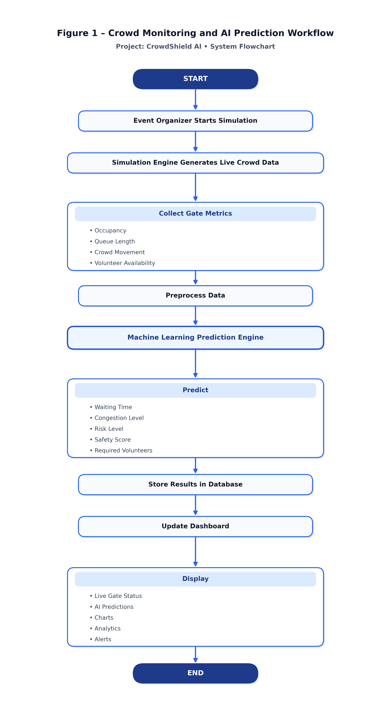

# Figure 1 – Crowd Monitoring and AI Prediction Workflow

**Project Name:** CrowdShield AI  
**Document Component:** Software System Flowchart  
**Target Medium:** University Project Report / Technical Documentation  

---

## 📸 High-Resolution System Flowchart

*Figure 1 – Crowd Monitoring and AI Prediction Workflow*

---

## 📁 Exported File Paths for Word Report

The flowchart has been generated in **High-DPI PNG (300 DPI)** and **Scalable Vector Graphics (SVG)** formats:

- **PNG Image (300 DPI High-Res):**
  - [`assets/crowdshield_ai_workflow.png`](../assets/crowdshield_ai_workflow.png)
  - [`docs/crowdshield_ai_workflow.png`](crowdshield_ai_workflow.png)
- **SVG Vector File (Infinite Scalability):**
  - [`assets/crowdshield_ai_workflow.svg`](../assets/crowdshield_ai_workflow.svg)
  - [`docs/crowdshield_ai_workflow.svg`](crowdshield_ai_workflow.svg)

> **Word Insertion Tip**: Modern versions of Microsoft Word (2019+) support native SVG insertion (`Insert > Pictures > This Device`). Using SVG ensures crisp, vector-grade lines and text at any zoom level or printed resolution.
